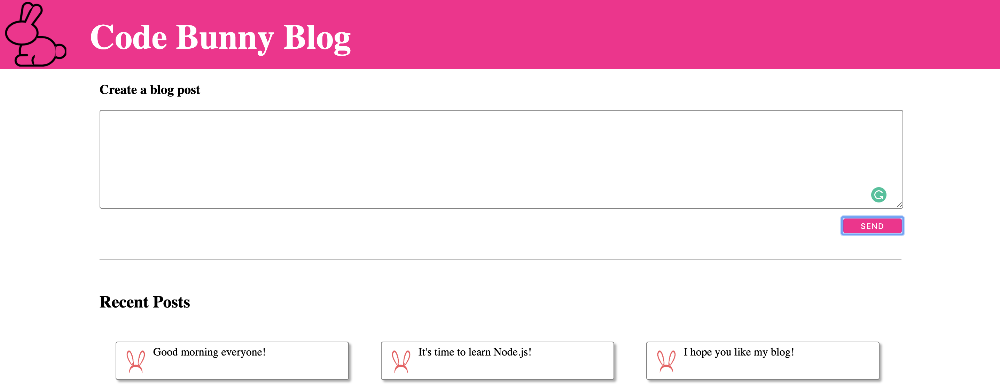
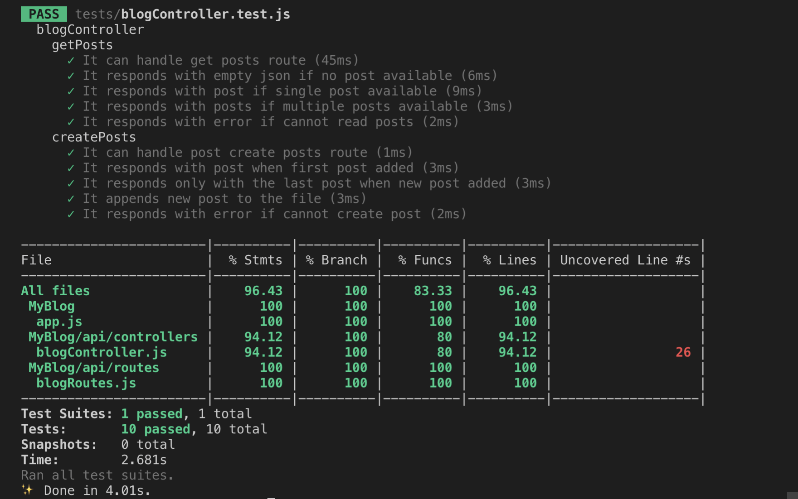

# My Blog

### Description

A blog web application with a Node.js back-end (based on an Express workshop).

### Getting Started

1. Clone this repo using `git@github.com:EdinaBMakers/MyBlog.git`
2. Install Node.js
3. To install dependencies: `npm install`
4. To run the server: `npm run start`

### Testing

The My Blog application has been written in TDD and tested using the Jest testing framework, with a test coverge of 96,43%. Tests can be run from the root directory using the `npm test` command.
To see a more detailed result, use the `yarn test --coverage` command.

